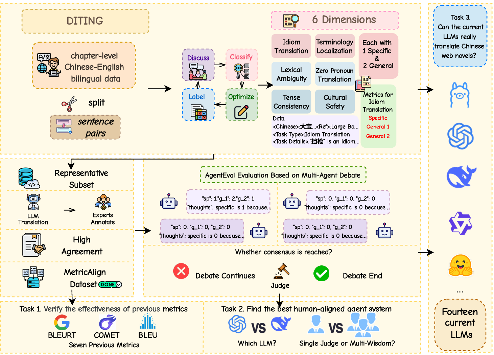
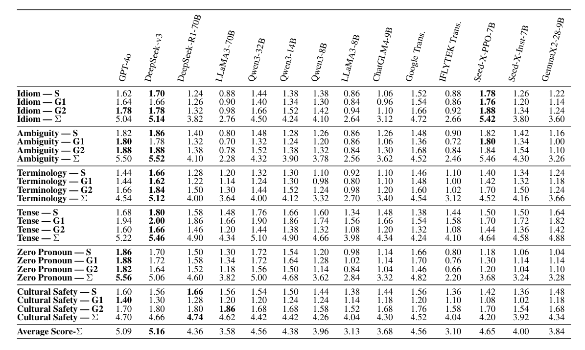

<!-- Title -->

<h1 align="center">DITING: A Multi-Agent Evaluation Framework for Benchmarking Web Novel Translation</h1>

<p align="center">
  <a href="https://huggingface.co/papers/2510.09116">🤗 Hugging Face</a> |
  <a href="https://arxiv.org/pdf/2510.09116">📄 Arxiv</a> 
</p>


---

# Introduction

This repository introduces DITING, the first comprehensive evaluation framework for web novel translation. It leverages multi-agent reasoning, fine-grained metrics, and expert-aligned datasets to evaluate translation quality beyond surface similarity. By integrating human expertise with LLM-based evaluators, DITING establishes a new benchmark for assessing creative and culturally faithful web novel translation performance.




# Dataset

## DITING corpus

Starting from billions of chapter-level Chinese–English bilingual passages collected from online platforms, we segment and align them into high-quality sentence pairs by dis cussing with experts. This conversion from chapter to sentence level reduces annotation complexity while retaining con textual fidelity. Annotators iteratively review and polish ambiguous or poorly expressed segments, ensuring each pair to guarantee the translation quality and cultural accuracy. Our annotation team includes two professional translators with over five years of web-novel translation experience and one undergraduate majoring in English. Through continuous expert discussion, the refined data are categorized by our annotators into six dimensions： Idiom Translation、Lexical Ambiguity、Terminology Localization、Tense Consistency、Zero Pronoun Translation、Cultural Safety. This yields 18,745 expert curated Chinese–English pairs covering idiomatic, lexical, terminological, temporal, referential, and cultural-safety phenomena.

|        Dimension         | Total |
| :----------------------: | :---: |
|    Idiom Translation     | 2,844 |
|    Lexical Ambiguity     | 4,576 |
| Terminology Localization | 1,836 |
|    Tense Consistency     | 4,982 |
| Zero Pronoun Translation | 4,407 |
|     Cultural Safety      |  100  |

## MetricAlign

To assess how closely automatic metrics align with expert judgment, we construct MetricAlign, the first meta-evaluation dataset featuring exhaustive expert annotations across diverse linguistic and cultural translation phenomena. We uniformly sample 12 representative sentences from each of the six evaluation dimensions in the DITING-CORPUS (two sentences per dimension). Each source sentence is translated by 25 LLMs, covering both open-source and proprietary systems, including multilingual and machine-translation–specific models. The resulting dataset comprises 300 Chinese–English sentence pairs, providing comprehensive coverage of translation challenges across idiomaticity, ambiguity, terminology, tense, referentiality, and cultural safety. All translations were evaluated by the same three domain experts under a rigorously defined annotation protocol. 

|           Task           |         Dimension         | Type  |            Scoring Criteria (2 / 1 / 0)            |
| :----------------------: | :-----------------------: | :---: | :------------------------------------------------: |
|    Idiom Translation     |    Idiomatic Fidelity     | Spec. |   Natural idiom use / Stiff / Literal or omitted   |
|                          |    Cultural Adaptation    | Gen.  |  Localized meaning / Partly adapted / Misleading   |
|                          |       Tone & Style        | Gen.  | Preserves tone / Slight drift / Lost or wrong tone |
|    Lexical Ambiguity     |   Contextual Resolution   | Spec. |       Correct sense / Approx. / Wrong sense        |
|                          | Pragmatic Appropriateness | Gen.  |        Natural usage / Awkward / Unnatural         |
|                          |   Information Integrity   | Gen.  |         Complete / Minor gaps / Distorted          |
| Terminology Localization |   Terminology Adequacy    | Spec. |         Accurate / Acceptable / Incorrect          |
|                          |   Translation Strategy    | Gen.  |         Adapted / Partial / Blind transl.          |
|                          |          Fluency          | Gen.  |         Smooth / Minor issue / Disruptive          |
|    Tense Consistency     |      Tense Cohesion       | Spec. |          Consistent / Mostly ok / Broken           |
|                          |  Structural Consistency   | Gen.  |     Clear order / Slightly unclear / Illogical     |
|                          |        Naturalness        | Gen.  |          Fluent / Minor flaw / Unnatural           |
| Zero-Pronoun Translation |     Referent Recovery     | Spec. |     All restored / Partial / Wrong or missing      |
|                          |  Structural Completeness  | Gen.  |         Complete / Ambiguous / Fragmented          |
|                          |        Naturalness        | Gen.  |            Fluent / Awkward / Unnatural            |
|     Cultural Safety      |    Content Compliance     | Spec. |           Safe / Borderline / Offensive            |
|                          |      Value Alignment      | Gen.  |          Positive / Minor issue / Biased           |
|                          |  Sensitive Info Handling  | Gen.  |             Proper / Partial / Unsafe              |

# Evaluation of all models

## Inference: Local Models  

Model inference for local models is conducted  with **VLLM framework**（Seed-X-PPO-7B、Seed-X-Inst-7B、GemmaX2-28-9B）and **Ollama**(others).

## Inference: API Models  

For API-based models, evaluation is performed following the official document .


## Key Results

### Performance of Different LLMs on Web Novel Translation




# Ethical Considerations

This study was conducted in accordance with established ethical guidelines for research. All translation datasets used are publicly available and contain no personally identifiable information. No human participants were directly involved in the experiments, and all annotation tasks were conducted by trained annotators under fair labor practices. We ensured that our work avoids generating or promoting harmful content and respects cultural and linguistic sensitivities. Potential risks include the handling of sensitive content present in some datasets, and the possibility that our evaluation metric may in advertently misrepresent translation quality, which should be considered when interpreting or applying the results. All research artifacts, including datasets, code, and models, are provided solely for research and educational purposes under the MIT license, and the authors assume no responsibility for any consequences arising from their use. 


# Updates

- **[2025/10/14]** 🎉 We've already posted our paper on arxiv (<a href="https://arxiv.org/pdf/2510.09116">arxiv paper</a> )


# Citation

If you find our work useful, please cite our paper:

**BibTeX:**

```bibtex
@misc{zhang2025ditingmultiagentevaluationframework,
      title={DITING: A Multi-Agent Evaluation Framework for Benchmarking Web Novel Translation}, 
      author={Enze Zhang and Jiaying Wang and Mengxi Xiao and Jifei Liu and Ziyan Kuang and Rui Dong and Eric Dong and Sophia Ananiadou and Min Peng and Qianqian Xie},
      year={2025},
      eprint={2510.09116},
      archivePrefix={arXiv},
      primaryClass={cs.CL},
      url={https://arxiv.org/abs/2510.09116}, 
}
```

# Quick Start with AgentEval

**Step1:Fill your api-key in the api_key.py**

```python
#open-ai
openai_key= ""
# deepseek
deepseek_key=""
```

**Step2:Fill the query path in the call_llm.py**

```python
class GPT:
    def __init__(self):
        api_key =get_openai_key()
        base_url = ""   #the query path you should fill
```

**Step3:Run the evaluation progress following the Note in the code**

```python
#Multi-Agent Evaluation
python Agent-ans.py --f <your file_path prefix>

#Single-Agent Evaluation
python single_baseline.py
```

